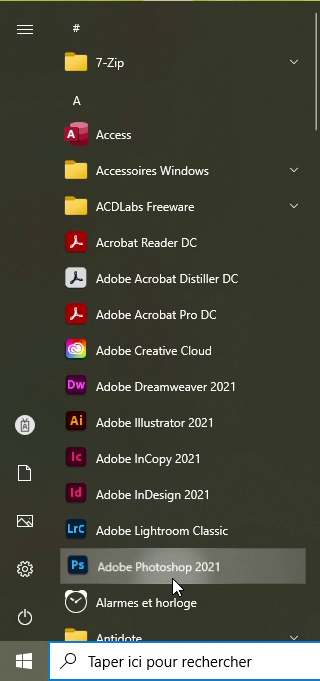
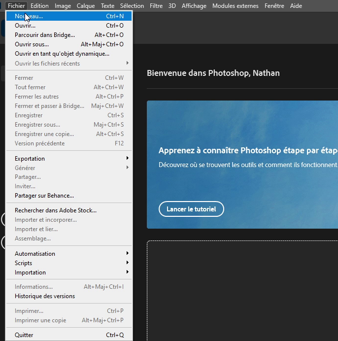
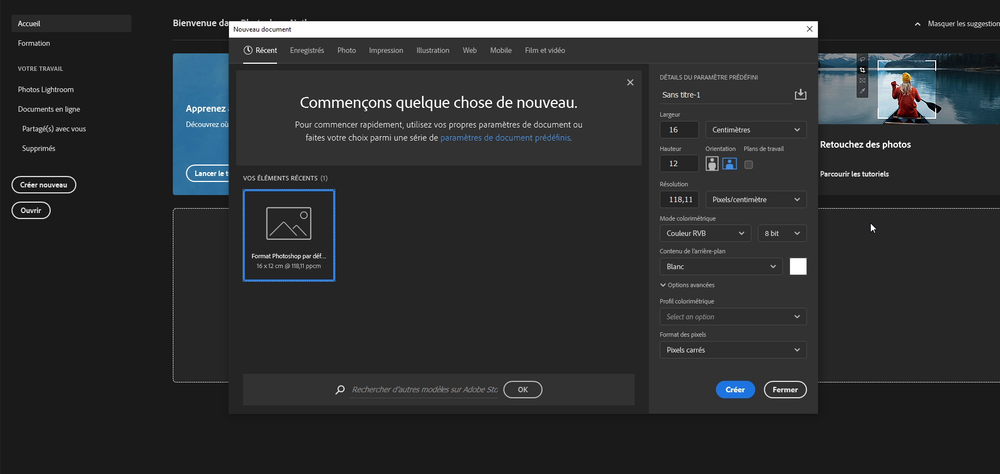

# Tutoriel
**Comment retracer des images dans Photoshop**

# Étape 1
 ***Ouvrir Photoshop*** parce que si vous évitez cette étape là, ça va être difficile de pouvoir continuer et compléter le tutoriel

# Étape 2
 Clqiuer sur fichier, nouveau pour hoisir et définir les règlages de votre planche de travail
 
 
 

 

