# Tutoriel
**Comment retracer des images dans Photoshop**

# Étape 1
 ***Ouvrir Photoshop*** parce que si vous évitez cette étape là, ça va être difficile de pouvoir continuer et compléter le tutoriel

# Étape 2
 **Clqiuer sur fichier, nouveau pour choisir et définir les règlages** de votre planche de travail
 
 
 
 

# Étape 3 
**Rechercher des images** sur internet puis **enregistrer les** 

 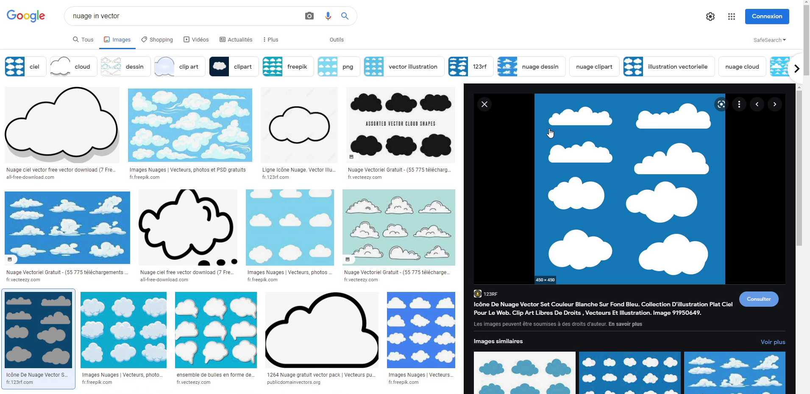
 
 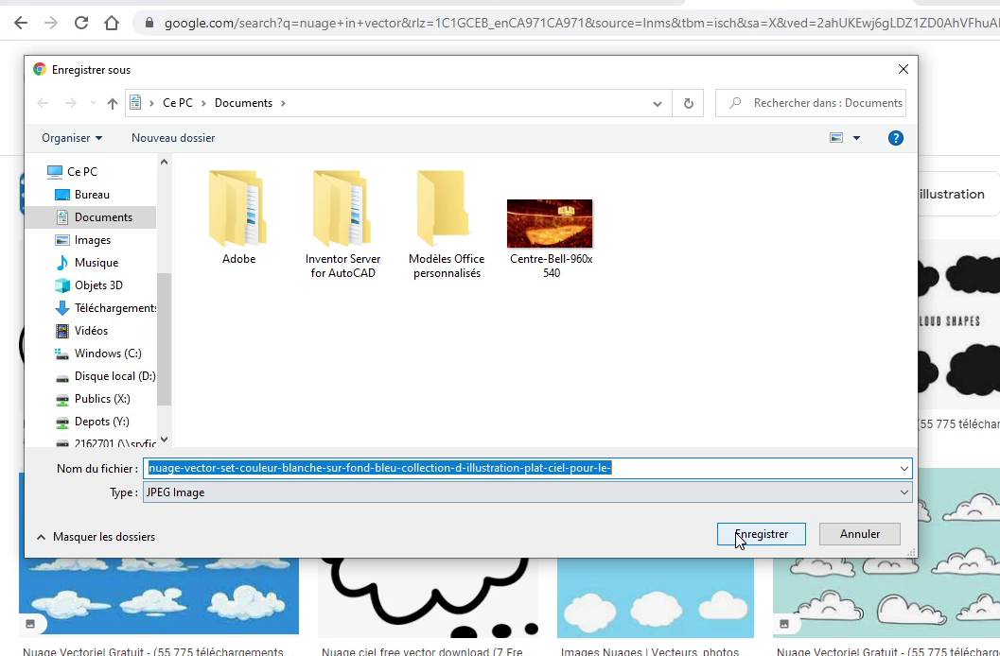
 

# Étape 4
**Ouvrir l'image dans photoshop puis utilisez l'outil de sélection d'objet pour sélectionner seulement ton objet ou un morecau de ton objet que tu veux selectionné**. (nuage dans mon cas)

 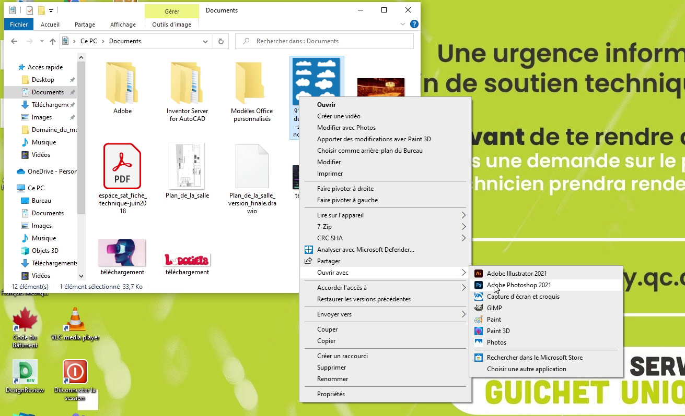
 
 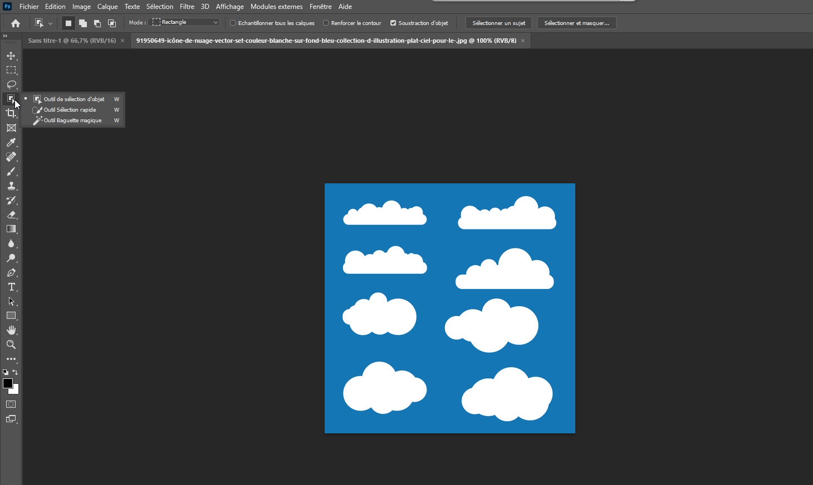
 
 
 
# Étape 5
**Cliquer sur «Sélectionner et masquer» puis appuyez sur affichage, incrustation** pour voir si il faut améliorer le contours ou inverser couleurs (mon cas aucun probleme). Ensuite cliquer sur Ok et puis clqieur en bas de la page pour faire apparaître votre masque que vpus venez de créer

 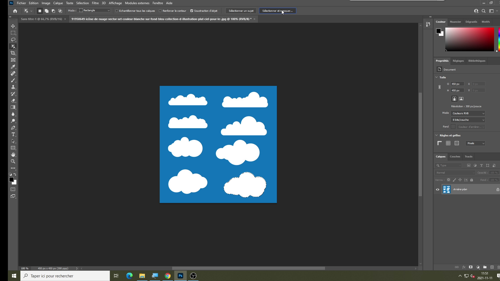
 
 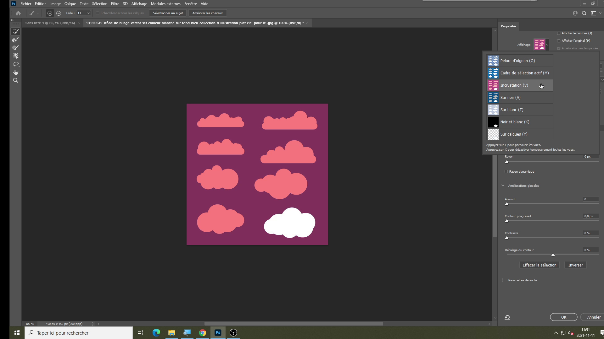
 
 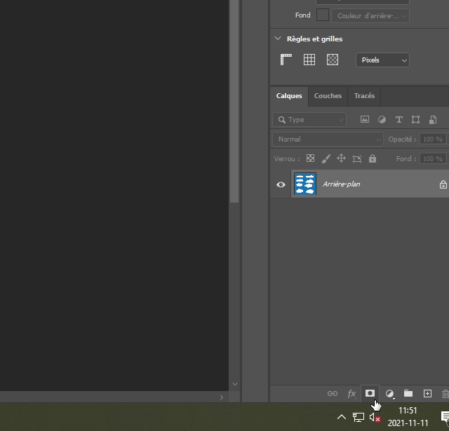

#Étape 6 
Après d'avoir **dupliquer le calque et de l'avoir envoyé dans votre planche de travail**, vous allez ensuite prendre **l'outil «plue et mettre des points un peu partout pour faire le tour de votre objet**.

 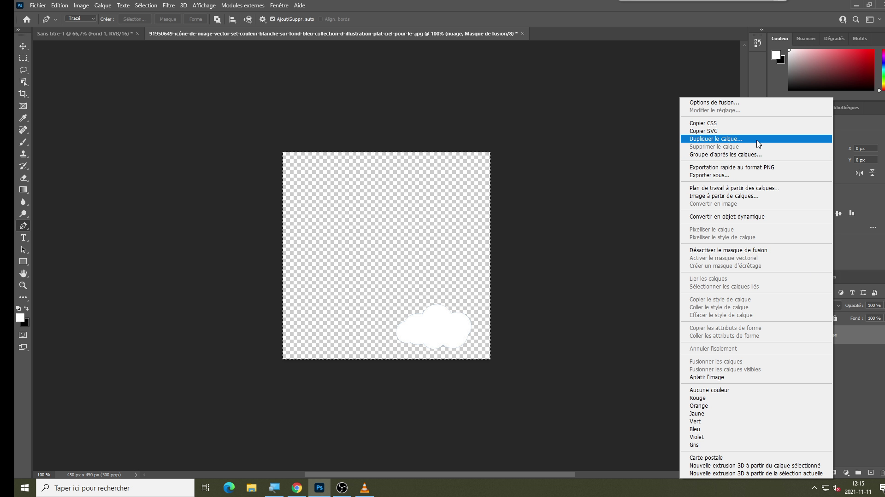
 
 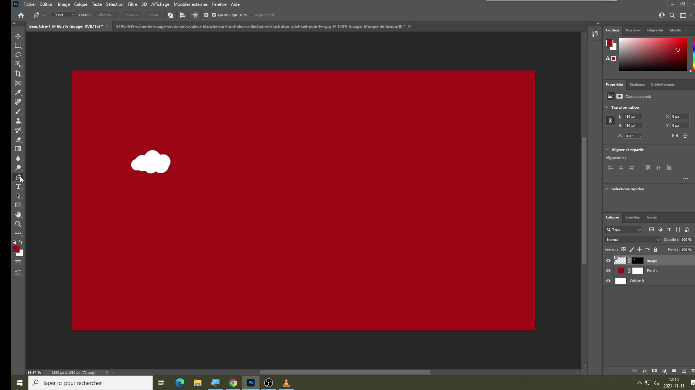
 
 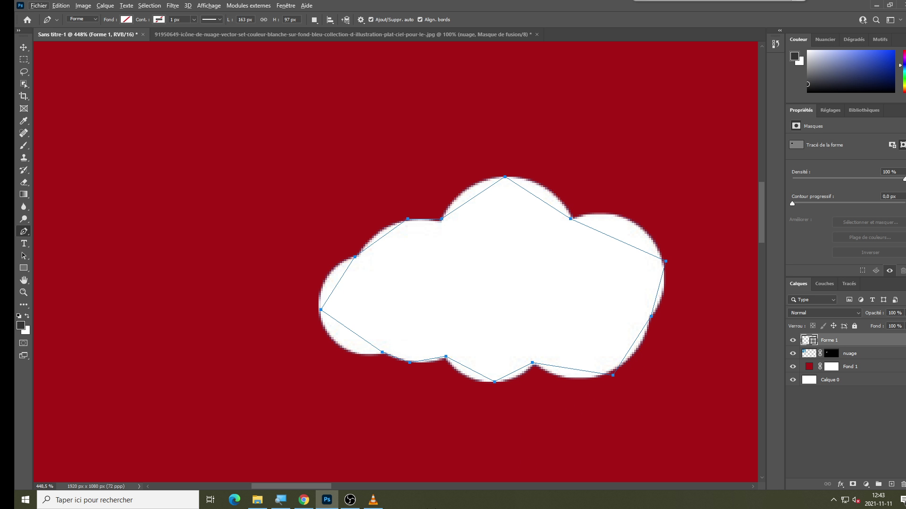
 
 
#Étape 7 
Arrondissez vos lignes pour qu'il touchent le contour de la forme. Pour se faire allez sur un des points et maintenez Alt et le bouton gauche de la souris tout en la déplacant juste a temps que ça sois bien placé

 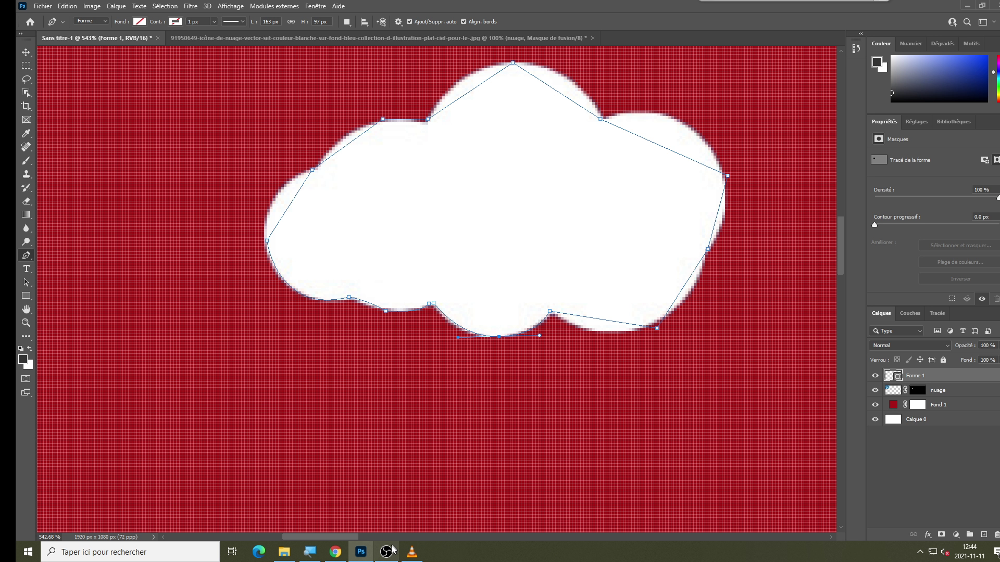
 
 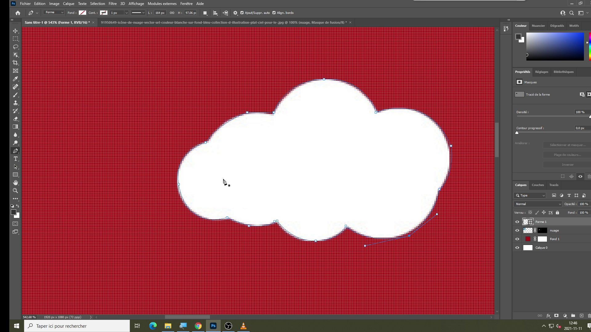
