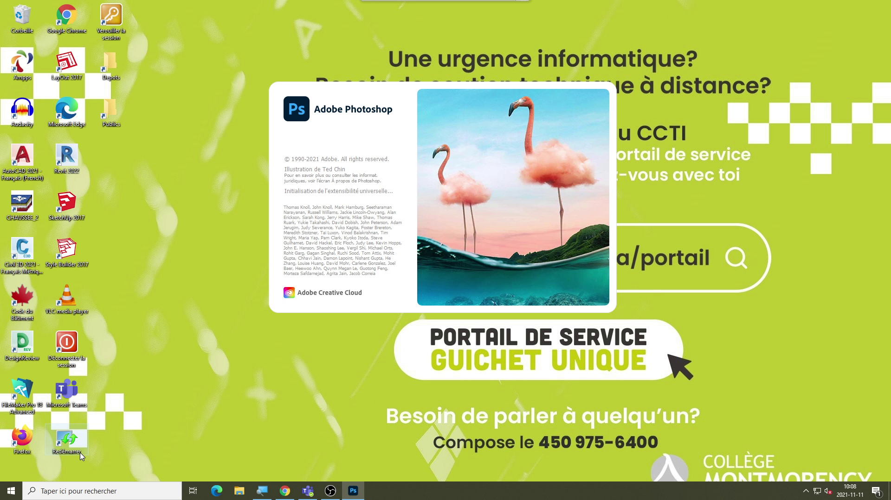

# Tutoriel
**Comment retracer des images dans Photoshop**

# Étape 1
 ***Ouvrir Photoshop*** parce que si vous évitez cette étape là, ça va être difficile de pouvoir continuer et compléter le tutoriel

# Étape 2
 **Clqiuer sur fichier, nouveau pour choisir et définir les règlages** de votre planche de travail
 
 
 
 

# Étape 3 
**Rechercher des images** sur internet puis **enregistrer les** 

 
 
 
 

# Étape 4
**Ouvrir l'image dans photoshop puis utilisez l'outil de sélection d'objet pour sélectionner seulement ton objet ou un morecau de ton objet que tu veux selectionné**. (nuage dans mon cas)

 ![Lien vers la photo](medias/
